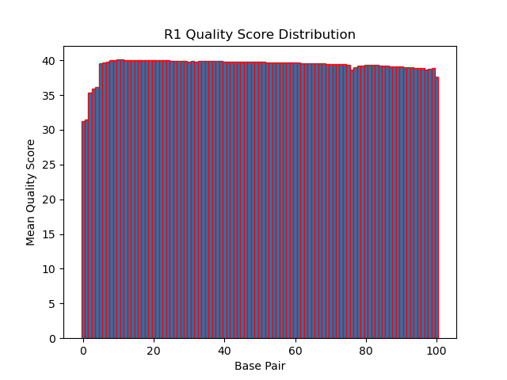
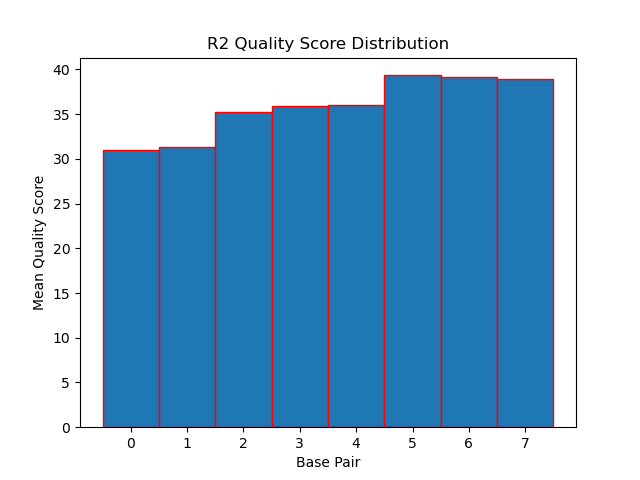
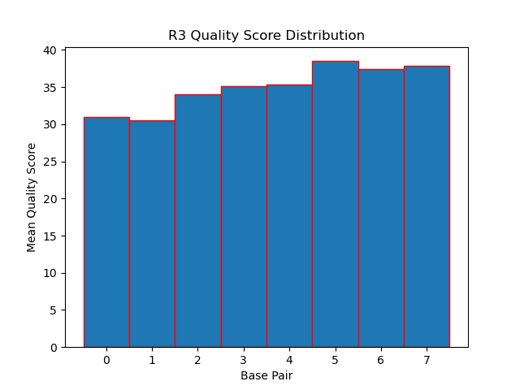
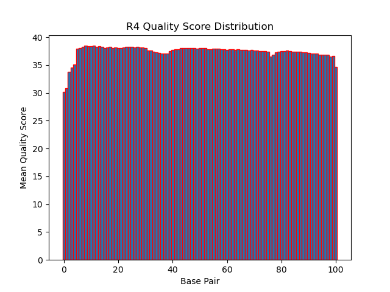

# Assignment the First

## Part 1
1. Be sure to upload your Python script. Provide a link to it here: [script](./score_distribution.py)

| File name | label | Read length | Phred encoding |
|---|---|---|---|
| 1294_S1_L008_R1_001.fastq.gz | read1 | 101 | 33 |
| 1294_S1_L008_R2_001.fastq.gz | index1 | 8 | 33 |
| 1294_S1_L008_R3_001.fastq.gz | index2 | 8 | 33 |
| 1294_S1_L008_R4_001.fastq.gz | read2 | 101 | 33 |

2. Per-base NT distribution
    1. Use markdown to insert your 4 histograms here:
    
    
    
    
    
    2. A good quality score cutoff for index reads is an mean score of 30 for all the basepairs. The first bp in the index is always  much lower, so having an individual base pair cutoff would not work. If the whole index averages a score of 30, then it is going to be very reliable. The chances of getting misidentified indexes will be very low in this case and it will allow for most of the reads to pass through as the mean for most of the basepairs is at least 30. For the biological reads, mean of 35 would be a good cutoff. This is the actual sequence data to be analyzed and therefore having a higher threshold will ensure higher quality. Having reads here that are low quality will not be helpful. 30 seems to be too low for the reads as that is what the average score is for the first, lower quality score base pairs in the reads.
  
    3.  ```
        For R2:
        cat /projects/bgmp/shared/2017_sequencing/1294_S1_L008_R2_001.fastq.gz | grep -A1 "^@" | grep -v "^@"| grep -c "N"
        3976613

        For R3:
        zcat /projects/bgmp/shared/2017_sequencing/1294_S1_L008_R3_001.fastq.gz | grep -A1 "^@" | grep -v "^@"| grep -c "N"
        3328051

        total: 3976613 + 3328051 = 7304664
        ```
## Part 2
1. Define the problem
2. Describe output
3. Upload your [4 input FASTQ files](../TEST-input_FASTQ) and your [>=6 expected output FASTQ files](../TEST-output_FASTQ).
4. Pseudocode
5. High level functions. For each function, be sure to include:
    1. Description/doc string
    2. Function headers (name and parameters)
    3. Test examples for individual functions
    4. Return statement
